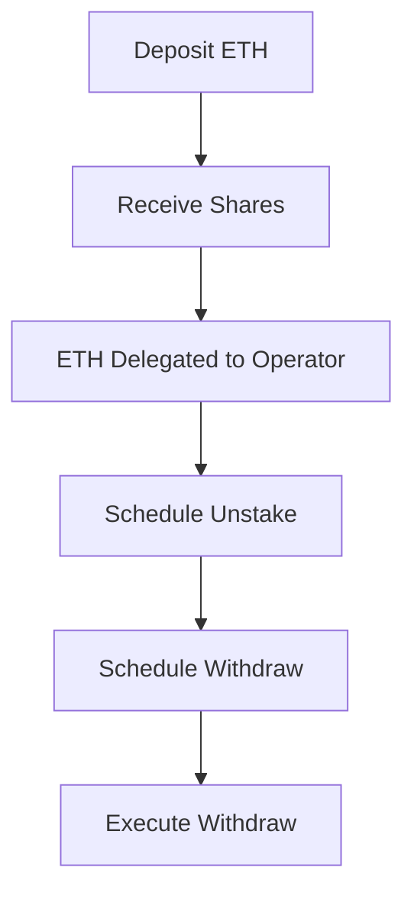

# Tangle Byzantine Vault

A smart contract adapter that integrates Byzantine Protocol's liquid restaking infrastructure with Tangle Network's restaking capabilities.

## Overview

This vault allows users to deposit tokens which get delegated to Tangle operators running blueprint services, while receiving a liquid staking token in return. The vault handles the complexities of managing deposits, unstaking, and withdrawals across both protocols.

Two vault implementations are provided:

- **TangleByzantineVault**: For native asset (ETH) deposits
- **TangleByzantineTokenVault**: For ERC20 token deposits

## Key Features

- **Liquid Staking**: Users receive shares representing their deposited ETH
- **Operator Delegation**: Automatically delegates assets to configured Tangle operators
- **Multi-step Withdrawals**: Handles the withdrawal process across both protocols:
  1. Schedule unstake from operator
  2. Schedule withdrawal from vault
  3. Execute final withdrawal
- **Cancellation Support**: Users can cancel unstaking or withdrawals at any point
- **State Management**: Tracks user requests and states independently
- **Token Support**: Handles both native assets and ERC20 tokens

## Technical Details

The vault is built on two main components:

1. **Byzantine Protocol**: Provides the ERC7535/ERC4626 vault implementations for liquid staking tokens
2. **Tangle Network**: Offers the restaking infrastructure through its MultiAssetDelegation precompile

### Architecture

- Inherits Byzantine's vault implementations for share-based accounting
  - ERC7535 for native assets
  - ERC4626 for ERC20 tokens
- Integrates with Tangle's `MultiAssetDelegation` precompile for operator delegation
- Implements state machines for tracking unstaking and withdrawal requests
- Ensures proper access control and user isolation

### Usage Flow

